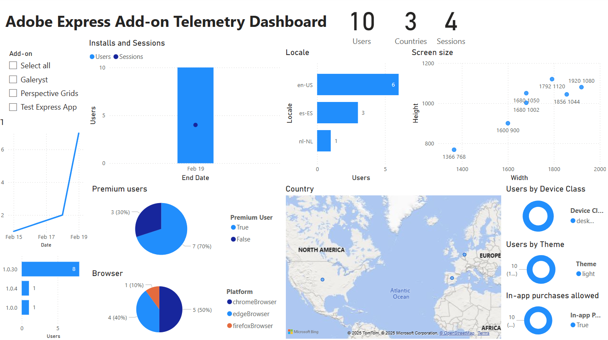
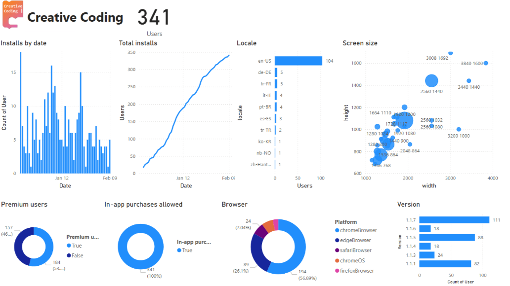

# Adobe Express Add-on Telemetry Dashboard

The Azure function will put data in Azure Storage Data tables `expressAnalyticsUsers` and `expressAnalyticsEvents` and these tables can be visualized in a [Microsoft Power BI](https://www.microsoft.com/en-us/power-platform/products/power-bi) dashboard with this [template](dashboard/Adobe%20Express%20Add-on%20Telemetry%20Dashboard.pbit) producing a customizable dashboard that looks like this:

## Template Usage

1. Download the Power BI Template `Adobe Express Add-on Telemetry Dashboard.pbit` from this repository folder.
2. Open it in [Microsoft Power BI Desktop](https://www.microsoft.com/en-us/power-platform/products/power-bi)
3. Connect the Azure Data Tables  `expressAnalyticsUsers` and `expressAnalyticsEvents` created by your Azure function.

This dashboard is used to collect telemetry from the Adobe Express Add-on [Creative Coding](https://adobesparkpost.app.link/TR9Mb7TXFLb?addOnId=w2ji95k72).

## Example Usage

Telemetry dashboard for [Creative Coding](https://adobesparkpost.app.link/TR9Mb7TXFLb?addOnId=w2ji95k72):

